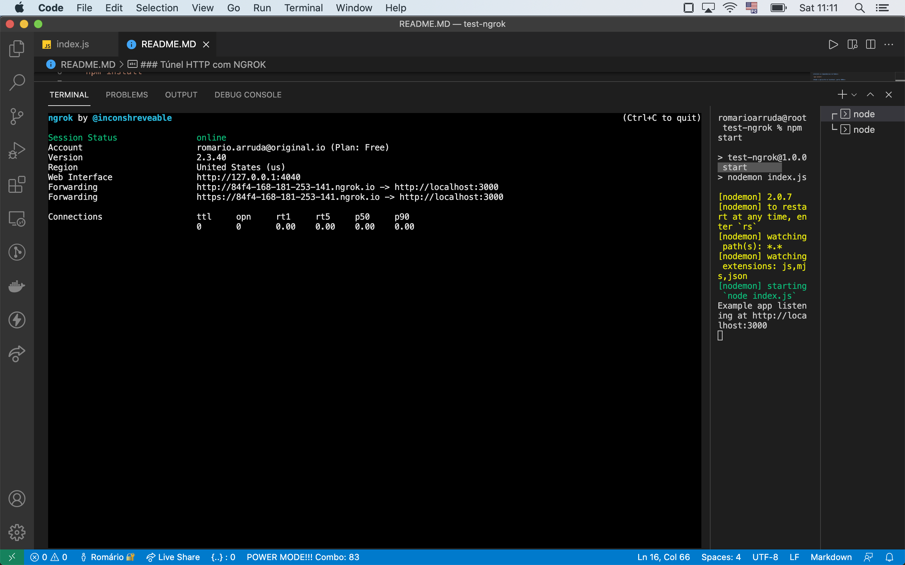

### Túnel HTTP com NGROK

**Instale as dependencias do Node**:

`npm install`

**Rode a aplicação no localhost, porta 3000**:

`npm start`

**Com o localhost up, execute o túnel usando o script ngrok**:

`./ngrok http 3000` ou `npm run ngrok`

Agora é só acessar a aplicação através do link gerado pelo NGROK.

Exemplo do resultando no terminal:

**Links úteis**:

[Página do ngrok](https://ngrok.com/)
